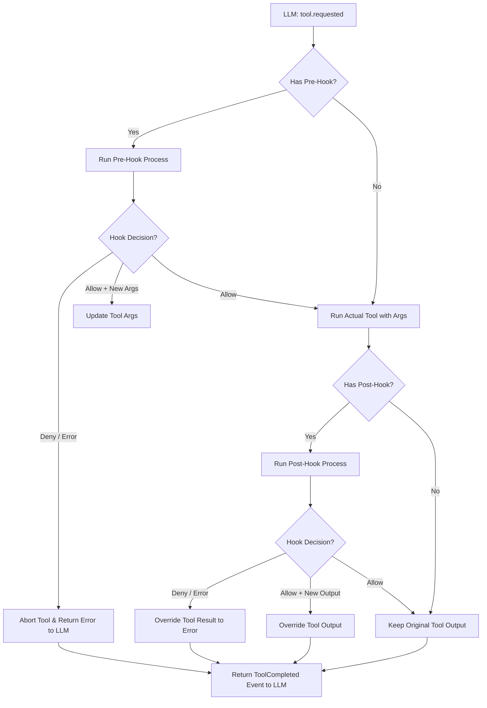

# 🔌 Kintsugi Lifecycle Hooks - Detailed Architecture & Design Spec

- **Author**: Aura & Thoor (Bodega Core Team)
- **Status**: APPROVED ✓
- **Date**: 2026-06-01
- **Target Subsystem**: Runtime Loop (`src/runtime/loop.ts`), Configuration (`src/config/config.ts`)

---

## 1. Overview & Objectives

### A. Context
In high-velocity development environments, developer agents must cooperate with deterministic quality checks (linters, formatters, test suites, and security scanners). Hardcoding these checks or relying on the LLM's raw reasoning to remember to execute them is inefficient and error-prone.

### B. Core Objective
Implement a robust, extensible, and language-agnostic **Lifecycle Hooks** system (`PreToolUse` and `PostToolUse`) inside Kintsugi. 
*   **PreToolUse Hooks** enable security sandboxing, input formatting, and argument validation. They can intercept, rewrite, or reject tool calls before they run.
*   **PostToolUse Hooks** enable automated test runs, linting, and smart token compression (truncating verbose logs) before returning results to the LLM.

---

## 2. Configuration & Discovery Schema

Hooks are defined via project-level configuration or discovered automatically in the workspace file system.

### A. YAML Configuration (`.kintsugi/config.yaml`)
We extend `KintsugiConfig` with a `hooks` property:

```yaml
hooks:
  mode: strict           # "strict" (block on hook error) | "permissive" (warn but continue)
  timeoutMs: 5000        # Max execution time per hook process
  pre:
    edit_file: "npm run lint -- --fix"
    bash: "node .kintsugi/hooks/pre-bash.js"
  post:
    write_file: "vitest run"
```

### B. Dynamic File-System Discovery
Kintsugi recursively scans the `.kintsugi/hooks/` directory. Files matching the naming conventions are automatically registered as hooks:
*   `pre-<tool_name>.[js|ts|py|sh]`
*   `post-<tool_name>.[js|ts|py|sh]`

*Resolution Priority:*
1. Explicitly configured hooks in `config.yaml` execute first.
2. Dynamically discovered script files in `.kintsugi/hooks/` execute second.

---

## 3. Standard JSON IPC Data Protocol

Hooks are executed as independent child processes. Communication is established via standard I/O streams using JSON.

### A. stdin Payload (Kintsugi -> Hook Process)
When a hook is triggered, Kintsugi writes a single-line JSON string to the child process's standard input:

```json
{
  "event": "pre",
  "tool": "edit_file",
  "id": "call_abc123",
  "arguments": {
    "TargetFile": "/Users/thoor/repo/kintsugi/src/index.tsx",
    "TargetContent": "const a = 1;",
    "ReplacementContent": "const a = 2;"
  },
  "context": {
    "workspace": "/Users/thoor/repo/kintsugi",
    "model": "claude-3-5-sonnet",
    "messageCount": 14
  },
  "output": null,
  "isError": false
}
```
*Note: In `post` hooks, `"output"` contains the string result of the tool's execution, and `"isError"` indicates if the tool failed.*

### B. stdout Response (Hook Process -> Kintsugi)
The hook script writes a single-line JSON string to stdout to return control:

#### 1. Continue Execution (Standard)
```json
{ "status": "allow" }
```

#### 2. Block/Abort Execution
```json
{
  "status": "deny",
  "error": "Linter failed: variable 'a' is declared but never used."
}
```

#### 3. Rewrite Tool Arguments (Only valid in `pre` hooks)
```json
{
  "status": "allow",
  "args": {
    "TargetFile": "/Users/thoor/repo/kintsugi/src/index.tsx",
    "TargetContent": "const a = 1;",
    "ReplacementContent": "const a = 2; // Formatted by Hook"
  }
}
```

#### 4. Override Tool Output (Only valid in `post` hooks)
```json
{
  "status": "allow",
  "output": "✓ Tests Passed successfully! [Output truncated for token efficiency]"
}
```

### C. Smart Fallback Mode (Non-JSON Support)
To support standard CLI tools directly (e.g., `npm run lint` which does not output JSON):
*   If stdout is empty or not valid JSON:
    *   **Exit code = 0**: Interpreted as `{ "status": "allow" }`.
    *   **Exit code != 0**: Interpreted as `{ "status": "deny", "error": "<raw stdout/stderr>" }`.

---

## 4. Runtime Integration Design (`src/runtime/loop.ts`)

Hooks intercept execution during the `executeToolRequest` sequence in Kintsugi's main execution loop.

### Runtime Flowchart



---

## 5. Fail-Safe, Timeouts & Error Recoverability

### A. Timeout Enforcement
To prevent hanging processes, every hook execution is governed by `timeoutMs` (default: `5000ms`).
*   On timeout, Kintsugi dispatches a `SIGKILL` to the child process.
*   If `mode == "strict"`, Kintsugi aborts execution and throws: `Hook Aborted: Timeout of 5000ms exceeded`.
*   If `mode == "permissive"`, Kintsugi logs a console warning and proceeds normally.

### B. Post-Hook Failure Recovery
If a `post` hook fails, the physical filesystem modification has already occurred. To recover:
1.  Kintsugi overrides the tool's result, setting `isError: true` and attaching the hook's error message.
2.  The LLM receives this error message in its context. Since it sees a tool failure (e.g. tests failed or lint failed), it is forced to issue a corrective turn to fix the bug, naturally achieving self-healing code loops!

---

## 6. Verification and Test Blueprint

Unit tests will be written using **Vitest** in `tests/runtime/hooks.test.ts`:

1.  **Unit Tests**:
    *   `should allow tool run when no hooks are defined`
    *   `should successfully run a pre-hook and pass arguments`
    *   `should allow pre-hooks to dynamically rewrite arguments`
    *   `should abort tool execution when pre-hook denies (strict mode)`
    *   `should allow post-hooks to dynamically rewrite tool output`
    *   `should fail tool run when post-hook denies`
    *   `should enforce timeout limits and terminate hanging hooks`
    *   `should gracefully fallback to exit codes for non-JSON outputs`
