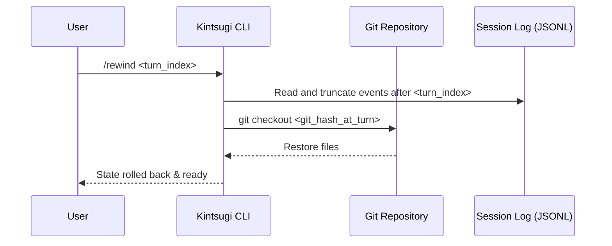

## Architecture

Time-travel uses Kintsugi's JSONL event ledger as the source of truth for session history. File state restoration leverages Git. Prior to executing each user/agent turn, Kintsugi creates a Git commit (or temporary git tree reference). When a rewind is triggered, Kintsugi rewrites the JSONL file and performs a `git checkout` or `git reset --hard` to the commit hash associated with that turn.



## Components

- **SessionFileStore**: Handles parsing, indexing, and truncating lines of the JSONL session logs.
- **GitSnapshotAdapter**: Wraps child processes running `git add` and `git commit` at the end of each turn, mapping them to turn indices, and executing hard checkouts during rewinds.

## Data Model

The JSONL entries are updated to include a metadata field for turn index and Git hash:

```json
{
  "turn": 3,
  "gitHash": "a1b2c3d4",
  "type": "USER_INPUT",
  "content": "Make edit..."
}
```

## Test Strategy

| Scenario ID | Test File | Type |
|-------------|-----------|------|
| JSONL session log is truncatable | `tests/session-time-travel.test.ts` | unit |
| Kintsugi Runtime hydrates state from truncated history | `tests/session-time-travel.test.ts` | unit |
| Workspace state rolls back using Git integration | `tests/session-time-travel.test.ts` | integration |
| Session branching forks the timeline | `tests/session-time-travel.test.ts` | unit |

## Dependencies

- Requires `git` CLI installed on the host system.

## Migration

Session JSONL format will have new optional fields `turn` and `gitHash`. Existing session files without these fields will default to index-only truncation and will skip git-based rollbacks.
