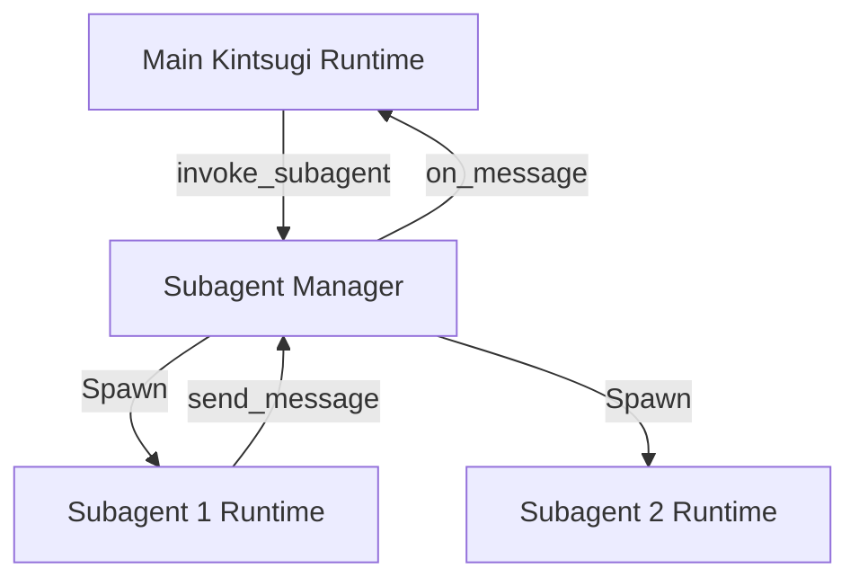

## Architecture

Subagent isolation is achieved by instantiating new, lightweight `KintsugiRuntime` classes in-memory. Each subagent has its own independent `MessagePool` for prompt history. Communication is carried out asynchronously via a message dispatcher, letting the host continue without blocking.



## Components

- **SubagentManager**: Spawns and manages subagent instances, tracks concurrency counts, and prevents spawning trees deeper than 2 levels.
- **SubagentRuntime**: Specialized wrapper around `KintsugiRuntime` that configures restrictive permissions, uses a separate message database, and links parent communication interfaces.

## Data Model

```typescript
interface SubagentConfig {
  id: string;
  role: string;
  prompt: string;
  permissions: string[]; // e.g. ["read_file"]
}

interface SubagentMessage {
  id: string;
  senderId: string;
  recipientId: string;
  content: string;
  timestamp: number;
}
```

## Test Strategy

| Scenario ID | Test File | Type |
|-------------|-----------|------|
| Subagents run with isolated history pools | `tests/subagents.test.ts` | unit |
| Subagents respect permission constraints | `tests/subagents.test.ts` | integration |
| Parent-child agents communicate via message-passing | `tests/subagents.test.ts` | integration |
| Depth and concurrency limits prevent token runaway | `tests/subagents.test.ts` | unit |

## Dependencies

None. Uses core in-memory abstractions.

## Migration

No database migration required. Backward-compatible.
